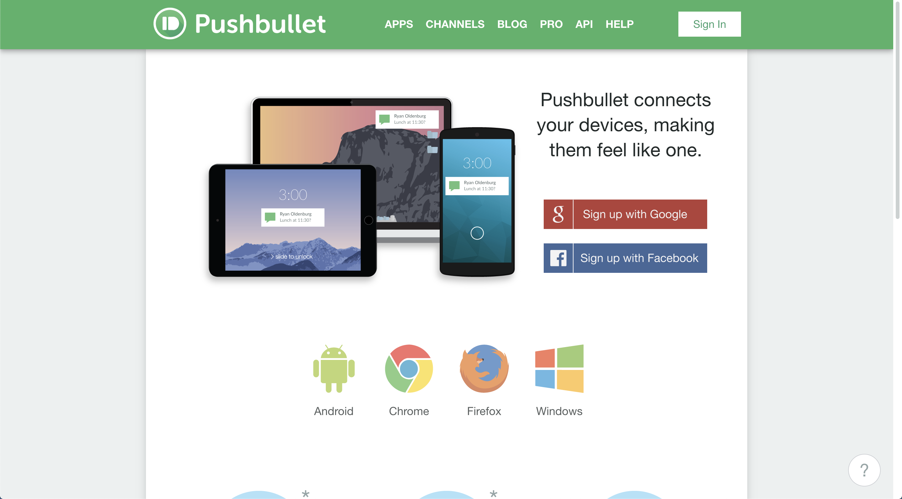
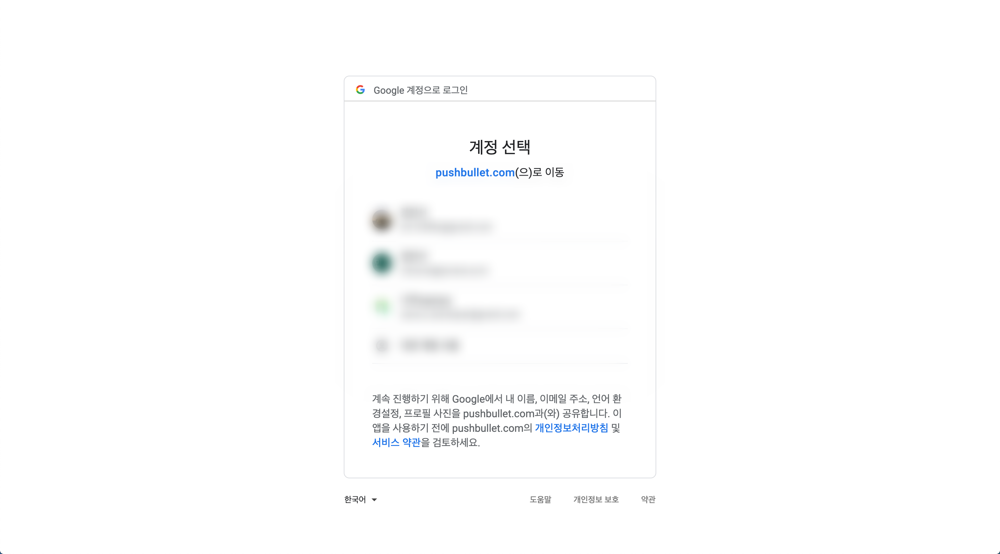
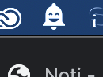

안녕하세요! **나무**입니다.

오늘날에는 효율성을 위해 노트북, 태블릿, 폰 등 다양한 플랫폼을 넘나들며 작업을 하는 것이 일상화되어있습니다. 그래서인지 최근 들어 작업의 연속성을 위해 소유하고 있는 기기들의 생태계를 통일시켜야겠다는 필요성을 더욱 체감하고 있습니다.

만약 모든 기기를 애플 기기로 통일시키고 iCloud를 정기 구독하고 있다면 아마 특별한 과정 없이도 통일된 애플 생태계를 누리고 있을 것입니다. (iCloud 동기화, 클립보드 공유, 사파리 공유, AirDrop...) 하지만 저와 같이 '맥 + 안드로이드' 조합을 사용하고 있다면 특별한 과정 없이는 위와 같은 연속성을 누리긴 어렶습니다. 심지어 맥과 안드로이드 폰을 연결하려면 Android File Transfer와 같은 프로그램이 필요한 정도인데요,,

따라서 이번 포스트에서는 맥과 안드로이드 간의 연속성을 위해 '안드로이드 폰의 알림을 맥에서 받아보자'라는 주제를 준비했습니다. 저의 경우 폰 알림을 무음으로 해놓기 때문에 맥으로 무언가를 작업하고 있으면 중요한 알림을 놓치거나 혹은 알림을 읽더라도 맥에서의 작업 분위기를 깨게 되는 경우가 종종 있었습니다. 때문에 두 플랫폼 간에 서로 알림을 공유받을 수 있으면 어떨까라는 생각을 하고 있었는데 이 케이스에 적합한 프로그램이 바로 **Pushbullet**과 **Noti**입니다. 두 프로그램은 각각의 장단점을 지니고 있는데 우선 Pushbullet부터 살펴봅시다.

# Pushbullet이란?

Pushbullet은 플랫폼 간 혹은 기기 간 데이터를 공유하는 서비스입니다. 본래 알림 공유를 목적으로 찾았었는데 안드로이드 알림 공유 외에도 'PC에서 폰 메시지 보내기', '링크 공유', '파일 공유' 등의 서비스도 제공하는 것 같았습니다. 하지만 이 포스팅의 목적은 맥과 안드로이드 간 알림 공유이므로 나머지 기능은 자세히 설명하진 않겠습니다.

[Pushbullet 사이트](https://www.pushbullet.com/)에 접속해보면 Pushbullet은 두 가지 OS (Android, Windows)와 두 가지 브라우저 (Chrome, Firefox)를 지원한다는 것을 확인할 수 있습니다.

> "어? 맥OS는 지원한다고 안 나와있는데요?"

사실 Pushbullet은 맥OS에서 프로그램으로 지원되지 않습니다. 대신 **Chrome 확장 플러그인**과 **Firefox 애드온**을 지원합니다. 즉, Pushbullet을 웹 브라우저 플러그인으로 설치해 안드로이드 폰의 알림을 웹 브라우저 알림으로 수신받는 방식입니다. 과거에는 Pushbullet이 Safari용 Extension으로도 존재했던 것 같은데 현재는 애플 정책으로 인해 지원하지 않습니다.

> "그럼 Chrome이나 Firefox가 항상 켜져있어야하네요?"

네, 웹 브라우저가 항상 켜져있어야 합니다. 특히 더 이상 Safari용 Extension은 지원하지 않으므로 Safari를 주력으로 사용한다면 다소 불편할 수 있습니다. (하지만 이 역시 해결하는 방법이 있으므로 게시물을 끝까지 봐주세요!)

그럼 본격적으로 Pushbullet을 설치해보겠습니다.

# Pushbullet 설치하기

1. 우선 [Pushbullet 사이트](https://www.pushbullet.com/)에 접속해 계정을 생성해줍니다. 저는 Google 계정을 이용해 진행하였습니다.

2. 생성을 마치고 해당 계정으로 로그인하면 아래와 같은 화면을 볼 수 있습니다.저는 이미 사용하는 중이라 초기 설정을 마친 상태이지만 처음 시작했다면 순서를 따라 초기 설정을 완료해야합니다.

3. 초기 설정을 따라 우선 안드로이드 폰에 Pushbullet 앱을 설치합니다.

4. 이어서 맥에도 브라우저 아이콘을 눌러 Chrome 웹스토어 또는 Firefox Addon 스토어를 통해 Pushbullet을 설치해줍니다. 저는 Chrome 웹스토어를 이용해 진행하였습니다.

5. 방금 설치한 앱과 확장 프로그램 모두 생성했었던 계정으로 로그인해줍니다.

6. 마지막으로 Pushbullet 앱의 '미러링' 탭에 있는 알림 미러링을 활성화합니다.

# Pushbullet 이용하기

지금까지 Pushbullet을 안드로이드 폰과 맥에 설치해 알림을 받기 위한 준비 과정을 모두 마쳤습니다. 이제 안드로이드 폰의 알림을 맥에서 받을 수 있습니다.

정말 잘 받아지는지 테스트하기 위해 '테스트 알림 보내기'를 눌러볼까요?

다행히 잘 작동하네요!

참고로 Pushbullet앱에서 알림을 보내고 싶은 앱을 선택할 수 있어 카카오톡이나 메신저와 같이 이미 맥용으로 존재하는 프로그램들은 선택 해제해 알림이 중복될 수 있는 것을 방지할 수 있습니다. 이제 맥으로 작업하다가 폰 알림을 확인하기 위해 수시로 집중을 깨야하는 일은 없어지겠네요.

하지만 이 방법은 분명히 문제점이 존재합니다.
1. 맥에서 알림을 받기 위해 Chrome 또는 Firefox가 항상 켜져있어야한다.
2. Safari만을 사용하고 있다면 단순히 알림을 받기 위해 추가로 브라우저를 켜는 것은 리소스 낭비이다.
3. 알림을 받을 때 크롬 아이콘과 함께 내용이 구분되어 있지 않아 알림 가독성이 좋지 않다.

잠깐! 개요에서 Pushbullet 외에도 Noti라는 프로그램도 있다고 소개했었죠? 바로 Noti를 통해 이를 해결할 수 있습니다.

# Noti란?

Noti는 Pushbullet의 문제점을 해결하기 위해 탄생한 맥용 프로그램입니다. 기본적으로 Pushbullet의 계정을 이용하지만 브라우저 플러그인을 사용하지 않기 때문에 Chrome, Firefox와 같은 웹브라우저가 상시 켜져있을 필요가 없습니다. 특히 맥의 native 알림 시스템을 이용하기 때문에 더 깔끔하게 알림을 받을 수 있습니다.

이 때 Noti는 사이트 소개에 따라 Pushbullet의 알림 기능만 사용할 수 있습니다. 비록 이 프로그램을 이용해서 Pushbullet의 더 다양한 기능을 사용할 수 없다는 것이 아쉽긴 하지만 저희의 목적은 일단 알림 공유이므로 저희의 갈증은 충분히 해소해줄 수 있을 것 같습니다.

그렇다면 다시 처음으로 돌아가서 Noti를 설치해봅시다.

# Noti 설치하기

1. 우선 알림 중복을 방지하기 위해 기존에 설치했던 Pushbullet 웹 확장 플러그인은 제거해줍니다. 물론 폰에 설치했던 Pushbullet 앱은 그대로 남겨둡니다.
2. [Noti 사이트](noti.center/)에서 DOWNLOAD (.DMG)를 눌러 개발자의 깃허브에 접속한 후 프로그램을 다운로드받습니다. 포스트 작성일 기준 (2020년 9월 15일)으로 0.3.2이 최신 버전이며 Noti.dmg를 눌러 진행할 수 있습니다.

    

3. 다운로드 받은 Noti를 설치하고 맥 상단바에 뜬 Noti 아이콘을 눌러 기존에 생성했던 Pushbullet 계정으로 로그인합니다.

# Noti 이용하기

이제 Noti를 이용해 맥에서 폰 알림을 받기 위한 준비 과정을 모두 마쳤습니다. 역시 잘 작동하는지 확인하기 위해 Pushbullet 앱에서 테스트 알림을 보내볼까요?

마찬가지로 아주 잘 작동하네요!

기존 Pushbullet 알림에 비해서 알림 제목, 알림 내용이 분리되어 나타나고 아이콘 역시 크롬 아이콘이 아닌 실제 앱의 아이콘을 보여주니 알림 가독성이 매우 좋아졌다는 것을 확인할 수 있습니다. 또한 Chrome이나 Firefox를 상시 켜둬야하는 필요도 없으니 사용하기도 훨씬 편해졌습니다.

물론 Noti 역시 두 가지 불편한 점이 존재합니다.

1. Pushbullet의 공식 앱이 아니기 때문에 언제 지원이 끊길지 아무도 장담을 못합니다. (github 커밋 기록에 따르면 2018년에서 업데이트가 끊긴 상태입니다. 하지만 일단은 포스트 수정일 (2021년 1월 31일)을 기준으로 macOS Catalina와 Big sur에서는 정상 작동함을 확인하였습니다.)
2. 맥을 sleep상태에서 다시 깨웠을 때 때때로 Noti서비스가 제대로 켜지지 않을 때가 있습니다. (아마 대부분의 맥북 사용자분들이 맥 전원을 끄지 않고 단순히 덮은 상태로 냅두실텐데 이 경우 다소 불편함이 있을 수 있습니다.)

# 마치며

지금까지 맥-안드로이드 간 알림을 공유하는 방법으로 Pushbullet, Noti를 소개하였습니다.

정리하자면 안정성을 더 중요시하시는 분들은 Pushbullet 공식 플러그인을 사용하시는 것을 추천드리고 사용성을 더 중요시하시는 분들은 Noti를 사용하시는 것을 더 추천드립니다. 개인적으로는 Noti의 장점이 더 크게 다가와 Noti를 사용하는 중입니다.

이외에도 같은 와이파이 내에서 안드로이드 폰의 알림을 맥과 공유하는 KDE Connect라는 프로그램도 존재하는데 역시 괜찮은 프로그램이니 꼭 계정을 이용하고 싶지 않다면 한 번 사용해보시는 것도 추천드립니다. 하지만 어떠한 프로그램을 사용하느냐와 상관없이 위와 같은 프로그램을 통해 폰의 알림을 맥에서 확인할 수 있으니까 작업의 효율성이 늘어났다는 느낌을 크게 받을 수 있었습니다.

혹시 맥-안드로이드 사용자이고 그렇지만 연속성을 포기하고 싶지 않다면 이와 같이 알림만이라도 공유해보면 어떨까요?

지금까지 나무였습니다. 다음 게시물에서 봐요!
